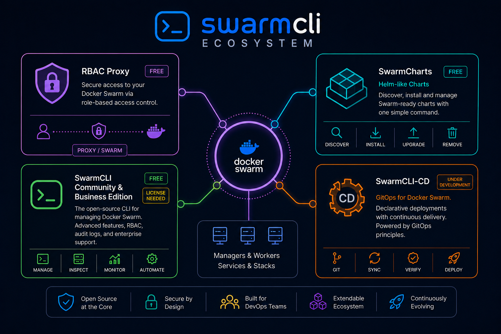
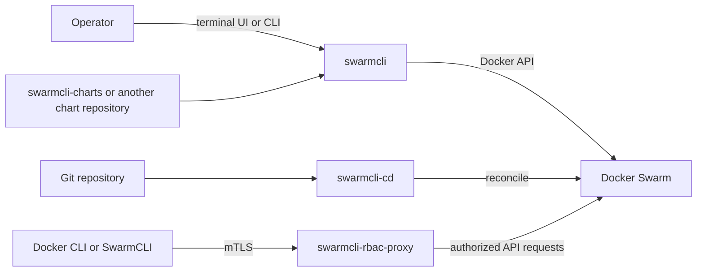

# SwarmCLI ecosystem

[SwarmCLI](https://github.com/Eldara-Tech/swarmcli) is a set of open-source tools for operating Docker Swarm with a fast terminal workflow, declarative chart releases, access control, and GitOps delivery. The projects are developed by [Eldara Tech](https://github.com/Eldara-Tech).

The four projects fit together, but they can also be used independently:

| Project | Purpose | Use it when |
| --- | --- | --- |
| [swarmcli](https://github.com/Eldara-Tech/swarmcli) | Terminal UI and chart engine for Docker Swarm | You need to inspect, operate, or deploy a Swarm from a terminal |
| [swarmcli-rbac-proxy](https://github.com/Eldara-Tech/swarmcli-rbac-proxy) | mTLS proxy with role-based access control in front of the Docker API | Several people or automation jobs need different levels of access |
| [swarmcli-cd](https://github.com/Eldara-Tech/swarmcli-cd) | GitOps continuous delivery controller | Git should be the source of truth and the cluster should reconcile continuously |
| [swarmcli-charts](https://github.com/Eldara-Tech/swarmcli-charts) | Community chart repository | You want reusable, versioned packages for common Swarm services |

## How the pieces fit

A small installation can start with `swarmcli` alone. Add the proxy when the Docker API must be shared, charts when you want repeatable packages, and `swarmcli-cd` when deployments should be driven by Git rather than a person or CI job.

## Choosing a starting point

- **Explore or operate one cluster:** install `swarmcli` and point it at the appropriate Docker context.
- **Package repeatable deployments:** use `swarmcli charts` and pin releases in `swarmcli-release.yaml`.
- **Share cluster access securely:** deploy `swarmcli-rbac-proxy`, issue client certificates, and assign each user the least-privileged role they need.
- **Reconcile from Git:** deploy `swarmcli-cd` on a manager and keep the application set in a Git repository.
- **Build a standard stack:** start with a chart from `swarmcli-charts`, inspect its values, and test with a non-production release first.

These projects are separate repositories with separate release cadences and licenses. Check each upstream repository before deploying: `swarmcli`, `swarmcli-cd`, and `swarmcli-charts` are Apache-2.0 projects, while `swarmcli-rbac-proxy` is AGPL-3.0-only.
